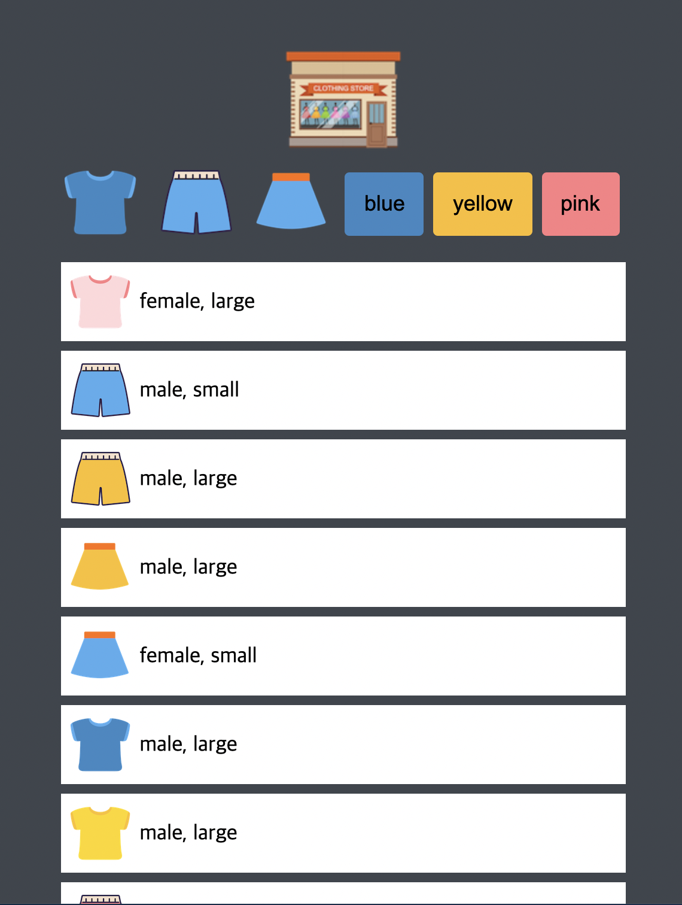
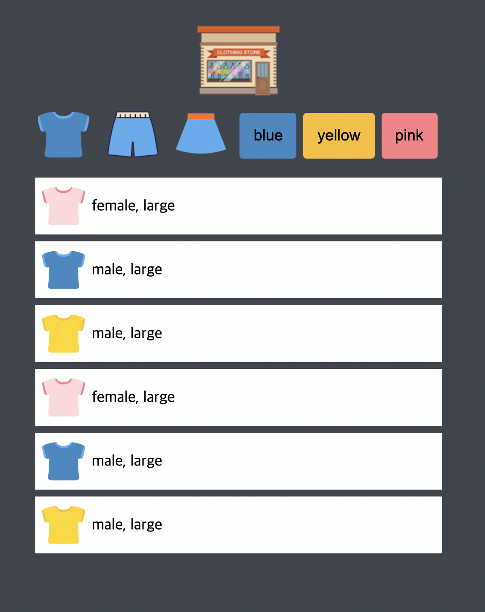
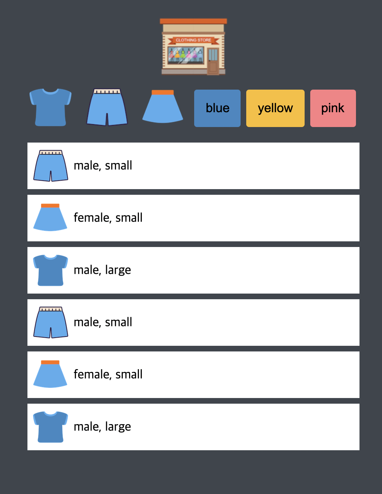
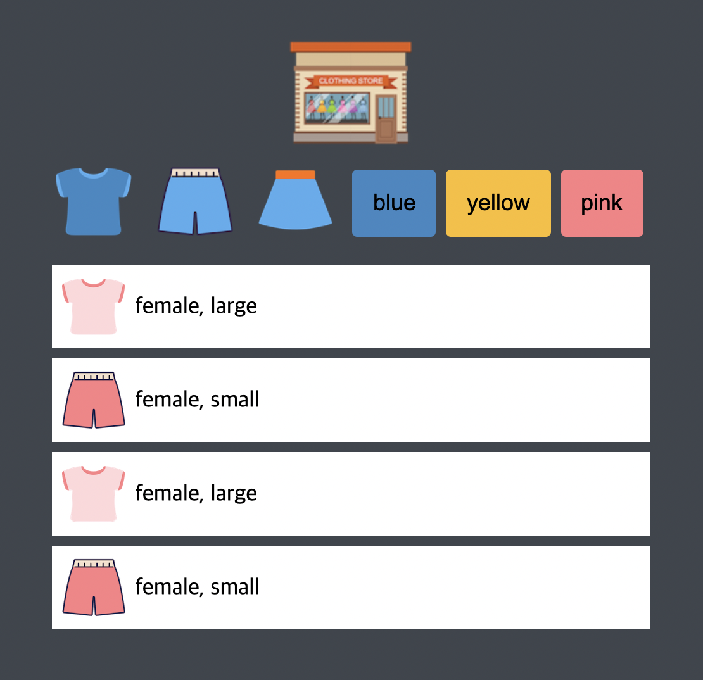

# 🛒shopping-game
Dream Coding을 통해 만든 미니 쇼핑 게임 

# 프로젝트 소개 
바닐라js를 이용한 미니 쇼핑 게임입니다. 
fetch를 이용하여 json을 변환합니다. 
logo icon 과 하위 icon 클릭이벤트를 추가하여 옷의 종류와 색상을 filtering 합니다.

# 기술 스택 
<ul>
    <li>HTML</li>
    <li>CSS</li>
    <li>Javascript</li>
</ul>

# Screen Shot 
Initial Screen 

Filtering... 

# Ref
https://developer.mozilla.org/ko/docs/Web/API/Fetch_API
https://developer.mozilla.org/ko/docs/Web/API/EventListener
https://developer.mozilla.org/en-US/docs/Web/API/Event
https://developer.mozilla.org/en-US/docs/Web/API/Event/target
https://www.youtube.com/watch?v=We2Kv1HMGvc 

